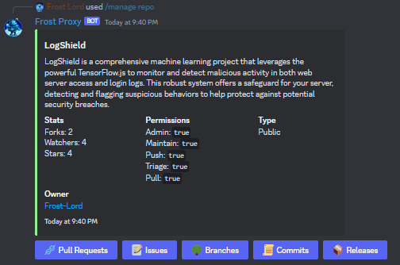
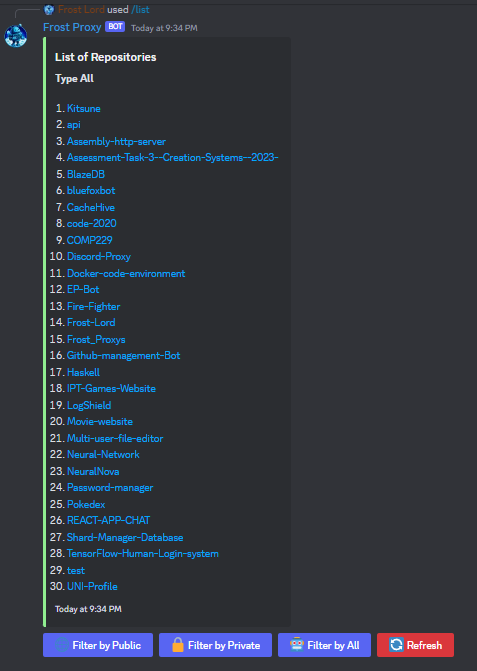

# Discord Bot - Repository Manager

This Discord bot is designed to help you manage your repositories directly from your Discord server. It provides commands to create and delete pull requests, issues, branches, commits, releases, and more.

    
    

## Features

- Create and delete pull requests
- Create and delete issues
- Manage branches
- View commit history
- Publish releases
- And more!

## Usage

1. Invite the bot to your Discord server.
2. Use the provided commands to manage your repositories.
3. Enjoy streamlined repository management directly from Discord!

## TODO

- [x] Implement basic repository listing functionality
- [ ] Add command to create pull requests
- [ ] Add command to delete pull requests
- [ ] Implement issue management commands
- [ ] Enable branch management functionality
- [ ] Incorporate commit history viewing
- [ ] Implement release publication commands
- [ ] Improve error handling and user feedback

Contributions are welcome! Feel free to fork this project, make improvements, and submit a pull request.

---

For any questions or support, please reach out to the bot's developer.
